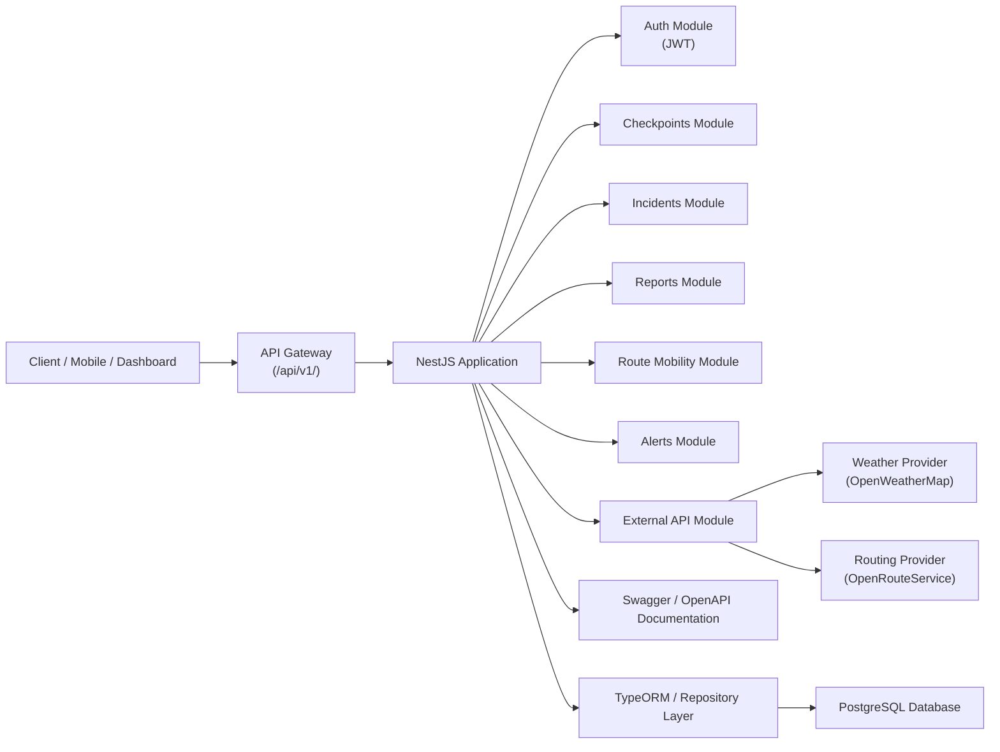

# Architecture & API Design

## System Overview

Wasel Palestine is a modular backend service built with **NestJS** and **TypeScript**. The application exposes RESTful APIs through a versioned API gateway at `/api/v1/...` and is designed around modular domain boundaries:

- `auth` — JWT authentication and authorization
- `checkpoints` — checkpoint management and history tracking
- `incidents` — incident reporting and verification
- `reports` — crowdsourced reporting and moderation
- `route-mobility` — route estimation and mobility intelligence
- `alerts` — geographic alert subscriptions and notifications
- `external-api` — integration with external weather and routing providers

The persistence layer is implemented with **TypeORM**. The primary database target is **PostgreSQL**; the repository includes support for multiple environments and local development.

## Visual Architecture

## High-Level Architecture

Wasel Palestine is built as a modular backend service. The diagram above shows the request flow from clients through the API gateway and into the NestJS module structure.

External services include:
- OpenWeatherMap or equivalent weather API
- OpenRouteService or equivalent routing API

## Component Responsibilities

- **API Gateway**
  - Handles request routing to module controllers
  - Enforces versioning with `/api/v1/`
  - Supports request validation, error handling, and security

- **Controllers**
  - Map HTTP requests to application service operations
  - Define input DTOs and response formats

- **Services**
  - Contain business logic for each domain area
  - Wrap database access and external API integration

- **Database Entities**
  - Define relational models and foreign-key relationships
  - Represent users, reports, votes, alerts, checkpoints, incidents, and history

- **External API Module**
  - Provides contextual weather and routing data
  - Enables fallback and caching patterns for reliability

- **Security**
  - JWT authentication with access tokens
  - Role-based access control for admin/moderator flows

- **Documentation**
  - Swagger/OpenAPI metadata is provided via `@nestjs/swagger`
  - API specs are exported into `docs/api/`

## API Design Rationale

### Versioned API

All public endpoints are exposed under `/api/v1/`, which enables safe evolution of the API without breaking existing clients.

### RESTful resource design

The system follows resource-based REST design:

- `GET /api/v1/checkpoints` — list checkpoints
- `POST /api/v1/reports` — create a report
- `PUT /api/v1/incidents/:id` — update an incident
- `GET /api/v1/route-mobility/estimate` — route estimation is performed through a dedicated resource

### Separation of concerns

- `external-api` is used for direct external provider verification and debugging.
- `route-mobility` is used for internal business logic around route estimation and mobility intelligence.

### Authentication semantics

- Public endpoints are explicitly marked and exclude authentication where needed.
- Protected endpoints require a Bearer JWT.
- Admin/moderator operations are restricted by role.

## External Integration Architecture

The external API module isolates third-party dependencies from the core domain logic.

- Weather data is fetched from a contextual provider and cached for performance.
- External routing requests are used for route validation or fallback when internal heuristics are unavailable.

This separation enables testability and simplifies future provider replacements.

## Documentation Flow

The API specification is available in `docs/api/Wasel Palestine API.openapi.json` and can be imported into toolchains such as Swagger UI, Apidog, or Postman.

The application also uses `@nestjs/swagger` to generate current API metadata at runtime when the server is running.
