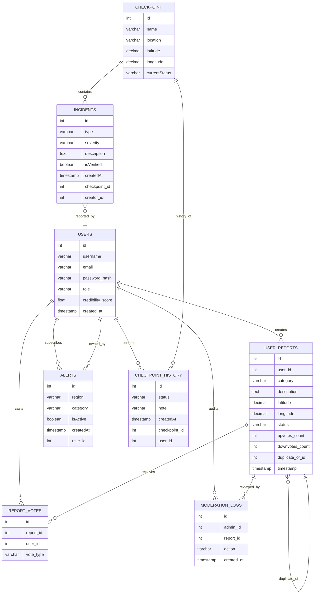

# Database Model & Entity Relationships

This document describes the primary relational entities and their relationships for the Wasel Palestine backend.

## Entity Relationship Diagram (ERD)

## Core Entities

### User

- Table: `users`
- Primary key: `id`
- Fields: `username`, `email`, `password_hash`, `role`, `credibility_score`, `created_at`
- Relationships:
  - One-to-many with `user_reports`
  - One-to-many with `report_votes`
  - One-to-many with `alerts`

### UserReport

- Table: `user_reports`
- Primary key: `id`
- Fields: `user_id`, `category`, `description`, `latitude`, `longitude`, `status`, `upvotes_count`, `downvotes_count`, `duplicate_of_id`, `timestamp`
- Purpose: stores crowdsourced citizen reports with moderation status and duplicate detection
- Relationships:
  - Many-to-one with `users`
  - Optional self-referential many-to-one on `duplicate_of_id`
  - One-to-many with `report_votes`

### ReportVote

- Table: `report_votes`
- Primary key: `id`
- Fields: `report_id`, `user_id`, `vote_type`
- Purpose: captures one vote per user per report
- Relationships:
  - Many-to-one with `user_reports`
  - Many-to-one with `users`

### ModerationLog

- Table: `moderation_logs`
- Primary key: `id`
- Fields: `admin_id`, `report_id`, `action`, `created_at`
- Purpose: audit trail for approve/reject decisions
- Relationships:
  - Many-to-one with `users` (admin)
  - Many-to-one with `user_reports`

### Checkpoint

- Table: `checkpoint`
- Primary key: `id`
- Fields: `name`, `location`, `latitude`, `longitude`, `currentStatus`
- Relationships:
  - One-to-many with `incidents`
  - One-to-many with `checkpoint_history`

### CheckpointHistory

- Table: `checkpoint_history`
- Primary key: `id`
- Fields: `status`, `note`, `createdAt`
- Relationships:
  - Many-to-one with `checkpoint`
  - Many-to-one with `users`
- Purpose: stores historical checkpoint status updates for auditability

### Incident

- Table: `incident`
- Primary key: `id`
- Fields: `type`, `severity`, `description`, `isVerified`, `createdAt`
- Relationships:
  - Many-to-one with `checkpoint`
  - Many-to-one with `users`
- Purpose: stores incidents tied to checkpoint locations and creators

### Alert

- Table: `alert`
- Primary key: `id`
- Fields: `region`, `category`, `isActive`, `createdAt`
- Relationships:
  - Many-to-one with `users`
- Purpose: stores user subscriptions for geographic notifications

## Relationship Summary

- `User` 1..* `UserReport`
- `User` 1..* `ReportVote`
- `User` 1..* `Alert`
- `UserReport` 1..* `ReportVote`
- `UserReport` 0..1 `duplicate_of` `UserReport`
- `User` 1..* `ModerationLog`
- `UserReport` 1..* `ModerationLog`
- `Checkpoint` 1..* `Incident`
- `Checkpoint` 1..* `CheckpointHistory`
- `Incident` N..1 `Checkpoint`
- `Incident` N..1 `User`

## Data Model Rationale

- The `duplicate_of_id` self-reference enables duplicate report detection without losing historical submission context.
- Separate `report_votes` ensures a single vote record per user and enables vote counts to be derived or aggregated efficiently.
- `ModerationLog` provides an immutable audit trail for admin actions.
- `CheckpointHistory` preserves changes to checkpoint status over time while keeping the current checkpoint record simple.
- Role-based user relationships support future scaling of moderator/admin verification, reporting, and alert subscriptions.

## Notes

- The repository is built around TypeORM entity metadata and the schema reflects the NestJS module structure.
- The database design is optimized for read-heavy listing endpoints and moderate write-heavy contribution/ moderation workflows.
